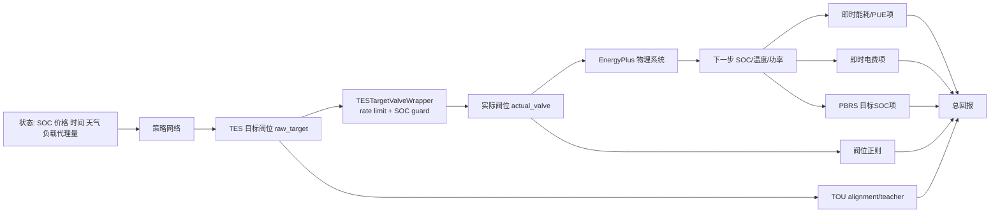

# 数据中心 TES 套利学习失效诊断与改进报告

## 执行摘要

本报告基于你提供的交接说明，以及对上传代码包中 `tes_wrapper.py`、`run_m2_training.py`、`evaluate_m2_rule_baseline.py`、`m2_reward_audit.py`、`m2_validate_tes_failure_modes.py` 与已有结果文件的静态审阅形成。已知关键事实包括：当前 M2-F1 只验证 TES 的分时电价套利，不含 workload action；观测 32 维、动作 4 维；TES 动作为目标阀位，经 rate limit `0.25/step` 后下发；主 reward 为 `rl_cost`；现有 A/B 结果表明 agent 并非“完全不用 TES”，而是学成了“高价多放、低价少放”，但**没有学会低价主动充冷**。fileciteturn0file0

我的核心结论是：**首要问题不是 TES 物理链路，也不是单纯探索不足，而是 reward/目标结构与动作语义共同把策略推向了“即时减载式放冷”，而非“跨时段库存调度式套利”**。更具体地说，你当前的总回报里，至少有三类信号在“即时层面”反对低价充冷：即时能耗/PUE 压力、当前时段电费压力、阀位正则；而鼓励低价充冷的主要是 PBRS、teacher、TOU alignment 这类辅助项。于是，策略最容易收敛到一个局部最优：**始终偏放冷，只在高价时放得更多、低价时放得更少**。这与当前观察到的失败模式高度一致。fileciteturn0file0

从理论上说，如果你希望论文里能严谨地区分“rule-informed RL”和“运行时规则控制器”，那么**最终用于报告结果的策略，必须在训练后期完全移除非 PBRS 的规则型辅助项**，否则最优策略可能被训练奖励永久改变；而如果 shaping 设计成动态 PBRS，则可以在不改变最优策略的前提下改善学习。时间相关的 PBRS 可以保持策略不变性，但 action-dependent 的 alignment/teacher 更适合被视为短期 curriculum 或 imitation，而不是最终优化目标本身。citeturn8view1

因此，我最推荐的短期路线不是“继续长训”，而是三步并行：**先修 reward，再修 TES 动作语义，再用最小 imitation/regularization 做可撤销引导**。如果只能做一轮 2 seed × 5–10 episode 的短训，我建议优先做：**取消 neutral 区间的中性 SOC 吸引、扩大低价充冷窗口、缩短 teacher 衰减到 1–2 episode、把 alignment 从常驻奖励改成前 1–2 episode 的 TES-head regularizer，并增加新的评价 gate：低价窗口负阀位率、峰前 SOC 上升量、以及 paired counterfactual 的 TES 边际利润。**fileciteturn0file0

## 问题定义与我采用的诊断假设

下面先把**已知信息**与**我必须补上的假设**分开，以免后文把“推断”误说成“事实”。

### 已知设置

你当前的训练对象是一个含 TES 的数据中心冷却系统，M2-F1 阶段不含 workload action，只验证 TES 是否能在分时电价下学到“低价充冷、高价放冷”；观测是 32 维，动作是 4 维，动作顺序为 `[CT_Pump_DRL, CRAH_T_DRL, Chiller_T_DRL, TES_DRL]`；TES 动作的符号语义为负值充冷、正值放冷；实际阀位会被 wrapper 以每步 `±0.25` 的速率朝目标推进，并在 `SOC<=0.10` 与 `SOC>=0.90` 处做 guard。当前主要 shaping 包括目标 SOC 的 PBRS、teacher/curriculum、二次阀门正则，以及新加入的 TOU alignment 项；现有 A/B 结果显示 `w=0.05` 并没有稳定优于 `w=0.0`，而且低价阀位仍为正。fileciteturn0file0

### 我将采用的诊断假设

| 维度 | 我采用的假设 | 说明 |
|---|---|---|
| TES 类型 | 冷储能 TES，SOC 已在环境中有效定义为 `[0,1]` | 由变量名 `TES_SOC`、`TES_avg_temp`、阀位充放语义推断 |
| TES 容量/效率/损耗 | 具体热容、往返效率、静态损耗未完全显式给出；诊断时把它们视为 EnergyPlus 模型内部真实存在且不变 | 不改物理模型 |
| 时间步长 | 15 分钟/步 | 代码与说明一致 |
| 价格信号 | 小时级 TOU，经 wrapper 对齐到 15 分钟步长 | 代码与说明一致 |
| 预测信息 | 有温度趋势、价格当前值、1h delta、距下个峰段时间；**没有显式未来负载预测** | 这是重要限制 |
| 负荷迁移 | 不允许 | M2-F1 没有 workload action |
| 售电/反送电 | 默认不考虑 | 现有 reward 看起来按购电成本组织 |
| 训练算法 | 以 SAC/DSAC-T 类连续动作 off-policy 方法为主，策略/值网络为 MLP `[256,256]` | 代码里如此配置 |
| 观测归一化 | 先用 1 个随机 episode warmup，再冻结 NormalizeObservation | 这会影响训练动态 |
| 评价目标 | 当前主目标仍然更接近“总体运行回报”，而不是“纯 TES 套利利润” | 这是最关键的诊断前提 |

这组假设里，**最敏感的是最后一条**：如果主 reward 不是“TES 的净套利收益”，而是“全系统即时经济性/舒适性/PUE 的组合”，那么“低价主动充冷”本来就可能不是最容易被学到、甚至不是被主目标最偏好的行为。这个判断与现有失败模式是一致的。fileciteturn0file0

## 证据驱动诊断



### 最可能失败原因排序

#### reward 结构存在方向性冲突

这是我认为的**头号原因**。

你要学的是“库存型行为”：低价时先忍受一些即时能耗/成本上升，把冷量存进去；高价时再兑现收益。可当前 reward 里，agent 每一步首先看到的是**即时惩罚**。如果低价充冷会抬高当下设施能耗、提高当前时段购电成本、同时又被阀位正则惩罚，那么对 actor 来说，“不充”甚至“继续弱放”会是更平滑、更即时的高回报方向；只有 PBRS、teacher、alignment 在反方向拉它。于是局部最优就会变成“持续放冷 + 价格调制强度”，这正是你现在观测到的行为。fileciteturn0file0

这里还有一个容易被忽略的点：你当前的 reward 不是纯 TES 套利利润，而是更接近“整站回报”。在这种设置下，如果数据中心 IT 负载本身占 facility 用电的大头，那么 TES 对总成本的边际可控部分会被明显稀释，导致 credit assignment 变难。也就是说，agent 每天都在为大量**自己根本改不了**的电费波动买单，这会提升回报方差，却不提供 TES 相关梯度。

#### 低价充冷窗口过窄，且与阀位惯性叠加后不利于翻向

按当前阈值，低价充冷只在“`price_current_norm <= -0.5` 且 `hours_to_next_peak_norm <= 0.4`”时被明确鼓励。结合上传的 TOU 数据，这基本把“鼓励充冷”的窗口压缩成了**每天峰段前约 4 小时的最低价窗口**。而系统是 15 分钟步长，阀位每步最多只改 `0.25`。这意味着如果策略在进入低价窗口之前还在正阀位放冷，它需要若干步才能翻到负阀位；在 4 小时窗口里，这种反向惯性会显著增加学习难度。于是 agent 很容易学成“低价少放”，但不愿真的跨过 0 进入充冷。

这条推断与现有数值完全吻合：你给出的 3-episode A/B 中，所有 learned policy 的**低价阀位均值都仍为正**，只是正值大小有变化；而 rule baseline 则能在低价窗口给出负阀位。fileciteturn0file0

#### PBRS 的 neutral attractor 过强，容易把 SOC 拉回中间而不是推动“峰前备货”

当前目标 SOC 设计是：高价 0.30、低价且峰前 0.85、其他 0.50。这个设计直觉上合理，但从学习角度看有两个副作用。

第一，它在大量“非关键窗口”内持续把 SOC 拉向 0.50，相当于给 agent 一个强烈的**中庸库存偏好**。如果再叠加即时能耗/电费惩罚，那么“围绕 0.5 轻微波动”会比“提前大幅充冷再在峰段放掉”更容易学。第二，动态 PBRS 虽然可以保持最优策略不变，但如果 shaping 只在窗口切换时才突然变强，而物理系统对动作的 SOC 反馈又有滞后，那么 agent 在进入低价窗口的最初几步只会感受到“目标变了、我现在不够高”，却还没来得及从充冷动作中收到正向结果，信用分配仍然困难。动态 PBRS 在理论上可以保持策略不变性，但实践上是否“好学”仍取决于潜在函数与系统延迟是否匹配。citeturn8view1

#### TES 动作语义不够“套利友好”

你让 agent 直接控制的是**阀位目标**，不是 TES 的“净充放功率”“模式（充/放/停）”或“库存轨迹目标”。对套利来说，这个动作语义并不直观。因为真正影响利润的是未来的**SOC 轨迹与高价时的可释放能力**，而不是阀门本身。阀位到冷量流到功耗的映射既非线性又强依赖工况。连续 RL 在储能套利里确实常见，但文献也指出，连续动作在这类问题里经常受限于动作裁剪、边界保守与利用率不足，而离散或混合动作更容易学出“充满/放空/空闲”式的 bang-bang 库存策略。citeturn3view1

#### 策略缺乏时间抽象与历史记忆

你的套利行为本质上是一个**多步持续策略**：提前数小时充，随后在峰段持续放。这类任务天然适合时间抽象或 options，而不太适合“每 15 分钟重新做一个平面连续动作”的扁平 MLP。经典 options 框架正是为这类“持续若干步的课程动作”提出的；在部分可观测连续控制里，recurrent SAC 一类方法也比纯 MLP 更可靠，但系统性探索仍然可能困难。citeturn11view0turn11view1turn11view2turn4view0turn4view1

#### 评价指标把“相对多放/少放”误判成了“学会套利”

这也是非常关键的一点。你当前已经注意到 `price_response_high_minus_low` 为正，不代表 agent 学会了套利。这一指标只能说明**高价比低价更偏向放冷**，却不能区分：

- 真套利：低价充冷、高价放冷；
- 假套利：低价少放、高价多放；
- 甚至错误库存：全天都放，只是高价放得更猛。

因此，评价 gate 必须升级到**符号正确率、峰前 SOC 净抬升、以及 TES 边际利润**三个层面，否则你会在“指标过关但机制不对”的路径上浪费很多实验。你自己的 handoff 已经非常清楚地暴露了这个问题。fileciteturn0file0

### 其他维度的诊断结论

在你要求我检查的那些关键维度中，我给出如下结论：

- **状态表示**：基本状态并不缺最关键的 TES 信息；`TES_SOC`、阀位、价格当前值、距峰时间都在。问题不在“有没有看到 SOC”，而在“有没有把未来可兑现收益表示得足够易学”。  
- **动作空间设计**：是明显问题。TES 用连续阀位目标，且和三个 HVAC 连续动作共用一个扁平 actor，TES 梯度很容易被即时 HVAC 梯度淹没。  
- **奖励/目标函数**：是首要问题。  
- **探索策略**：有影响，但不是第一位。因为你不是“完全不用 TES”，而是在用一个更容易的局部模式。  
- **模型架构**：纯 MLP `[256,256]` 对这种库存任务不是最佳，但不是主病因。  
- **训练稳定性**：存在种子差异，但从已有 loss/σ 指标看不像是彻底发散，更像是学到了错误局部最优。  
- **样本效率**：偏差。全年长 episode + 稀释 replay，会削弱每日 4h 关键窗口的密度。  
- **仿真环境物理一致性**：你已经基本排除了。  
- **延迟/观测噪声**：物理延迟和阀位 rate limit 真正重要；观测噪声目前没有证据表明是主因。  
- **约束处理**：guard 不是主因，但“guard + rate limit + continuous action”一起会让 sign flip 更难。  
- **奖励稀疏性**：不是纯稀疏，而是**稀疏正确 + 稠密错误**。  
- **归一化/尺度问题**：建议检查，但我不把它排到前二。  
- **随机种子与基线比较**：必须强化，尤其需要 paired counterfactual baseline，而不是只看单跑 summary。  

## 可复现调试步骤与优先级

下面这份清单按“**容易实现** × **潜在收益**”排序。

### 最高优先级

#### 先做 reward 分解审计，而不是先加大 shaping

在 `sinergym/envs/tes_wrapper.py` 与 reward monitor 中，抽取以下字段，围绕**每天低价窗口开始前后各 8 步**与**峰价窗口开始前后各 8 步**打印：

- `TES_SOC`
- `tes_valve_target`
- `TES_valve_wrapper_position`
- `price_current_norm`
- `price_hours_to_next_peak_norm`
- `reward`
- `cost_term`
- `energy_term`
- `comfort_term`
- `tes_pbrs_term`
- `tes_teacher_term`
- `tes_tou_alignment_term`
- `tes_valve_penalty`
- `tes_invalid_action_penalty`

你的目标不是看均值，而是看**在“应该翻向充冷”的第一小时内，哪个 reward 分量把动作拉回去了**。如果你看到 `pbrs` 为正但 `cost_term + energy_term + valve_penalty` 绝对值更大，那么这就不是探索问题，而是目标冲突问题。

#### 把 neutral 区间的 PBRS 改成“无 shaping”

这是我最推荐的**最小代码改动**。

当前 neutral target = 0.50，容易把库存拉回中位。建议把逻辑改成：

- 高价窗口：保留低 SOC target；
- 低价且峰前窗口：保留高 SOC target；
- **其他时间：`phi = 0`，不做 PBRS。**

也就是不要在大部分时间持续鼓励“靠近 0.5”。这样做的好处是：  
一，避免“中间库存吸引子”；  
二，只在真正与套利有关的窗口产生 shaping；  
三，从论文表述上也更干净，因为你强调的是“对任务结构的潜在函数”，不是“人为规定全天理想库存曲线”。  
PBRS 的理论动机来自潜在函数差分，时间相关的 dynamic PBRS 仍可保持策略不变性。citeturn8view1

#### 扩大低价充冷窗口

我建议首先把下面两项同时改掉：

- `tes_low_price_threshold`: 从 `-0.50` 改到 **`-0.10`**
- `tes_near_peak_threshold`: 从 `0.40` 改到 **`0.60`**

理由很简单：你当前窗口过窄，实际上几乎只覆盖最低价 tier；而套利从来不是“只有绝对最低价才值得充”。对一个有阀位惯性、物理延迟、训练又很短的 agent 来说，把充冷窗口放宽到**峰前 6 小时**更符合系统辨识与 credit assignment 的需要。

#### 升级评价 gate

新增三个指标，替代仅看 `price_response_high_minus_low`：

- `charge_window_sign_rate`：在“低价且峰前”窗口内，`actual_valve < -0.05` 的步数占比；
- `delta_soc_prepeak`：峰前窗口尾 SOC − 峰前窗口首 SOC；
- `tes_marginal_profit`：**同一 seed、同一周、同一 HVAC 动作**下，`full_learned` 与 `learned_hvac_tes_zero` 的成本差。

如果第一项没有过，说明根本没学会充冷；如果第一项过了但第三项没有过，说明评价指标与经济目标错位；如果第一项一定要靠 shaping 开着才过，说明探索/信用分配仍未解决。

### 次高优先级

#### 把 teacher/alignment 从“常驻奖励”改成“短期 regularizer”

如果你担心“规则控制器伪装成 RL”，那我不建议继续直接加大 `tes_tou_alignment_weight` 并长期挂在 reward 里。因为这类 action-dependent shaping 会改变最优策略，理论上不如 PBRS 干净。citeturn8view1

更好的做法是：

- 只对 **TES 头** 做 regularization；
- 只在 **低价充冷窗口** 和 **高价放冷窗口** 开启；
- 只持续 **前 1–2 个 episode**；
- 之后权重衰减到 0，再继续纯 RL fine-tune。

实现上可以很简单：

```python
L_actor = L_rl + lambda_reg(t) * mask_tou(t) * (a_tes - a_rule_tes)**2
lambda_reg(t) = lambda0 * max(0, 1 - episode / 2)
```

这样训练时你是在“告诉它先会翻向”，而不是“永久按规则给奖励”。建筑控制场景里，用 imitation / behavioral cloning 或 rule-based policy regularization 作为起步器，能够显著降低早期坏探索并提高部署可行性；但关键在于**后期把规则扶手拿掉**。citeturn3view3turn5view3turn6search0

#### 在状态里加上“可见的库存变化”

当前状态已经有 `TES_SOC` 和阀位，但我建议再加两个很便宜的特征：

- `delta_soc_1step = SOC_t - SOC_{t-1}`
- `time_in_tou_window` 或 `steps_since_window_start`

前者让 agent 更快辨认“我这个动作到底是在充还是在放”；后者让 agent 不必仅靠 `hours_to_next_peak_norm` 去推时间余度。这是低成本增强，不需要改物理模型。

#### 重点检查 raw-target 到 actual-valve 的偏差峰值

你现有诊断里已有 `raw_actual_divergence`、`raw_actual_divergence_p95` 与 `tes_intent_to_effect_ratio`。下一步不要只看均值，要看**偏差是否集中发生在 price window 切换时**。如果是，那么证明问题恰恰出在“需要翻向”的关键时刻，而不是平时控制不准。

### 第三优先级

#### 再做探索/熵的 ablation，而不是先做

如果前两类修改之后仍没有 sign flip，再做探索强度 ablation。因为系统当前的问题更像“目标不对”而不是“不会乱试”。

若要做，建议只做很小的网格：

- `target_entropy ∈ {-4.0, -2.0, -1.33}`
- 每组 2 seed，5 episode
- 其他参数固定

目标不是找最优值，而是判断：**充冷是否只在更高探索下才出现**。如果是，那么探索是二阶主因；如果不是，就不要继续在 entropy 上耗时间。

## 改进策略

### 稀疏而干净的套利型 PBRS

这是我最推荐的第一策略。

核心思想不是再加一层规则，而是把现在“全天都想管库存”的 shaping，改成“只在真正相关的窗口上塑形”。

#### 实现要点

- neutral 区间令 `phi=0`
- 低价峰前区间：`phi = -kappa * (soc - soc_charge_target)^2`
- 高价区间：`phi = -kappa * (soc - soc_discharge_target)^2`
- 初始建议：
  - `soc_charge_target = 0.90`
  - `soc_discharge_target = 0.25`
  - `kappa = 1.0 ~ 2.0`
- 低价窗口放宽到 `low_price_threshold=-0.10`、`near_peak_threshold=0.60`

#### 风险

若窗口定义过宽，agent 可能学成“过早充冷”，带来舒适性或能耗副作用。

#### 验证实验

对照组是当前配置；实验组只改 PBRS 结构，不加 teacher、不加 alignment。  
主要指标看 `charge_window_sign_rate`、`delta_soc_prepeak`、`tes_marginal_profit`。若该组单独奏效，就说明主因是 reward 结构，不是探索。

### TES 动作头重构

这是第二策略，也是我认为**中短期收益很高**的一条。

文献和经验都说明，储能套利常常更适合离散或混合动作，而不是直接让 actor 对连续阀位做全域控制；因为套利任务天然接近“充/停/放”的模式决策，连续动作又容易被边界、裁剪和保守性拖住。citeturn3view1

#### 两种可实施版本

**版本 A：离散模式 + 连续幅值**

- 高层输出 `mode ∈ {charge, idle, discharge}`
- 低层输出 `amp ∈ [0,1]`
- 最终 `tes_target = sign(mode) * amp`

**版本 B：高层 option，每小时更新一次 TES 模式**

- 每 4 个 15 分钟步才允许 TES 模式改变一次
- 模式持续 1 小时，幅值由低层平滑执行

第二种做法更接近时间抽象。经典 options 方法就是为这种“多步持续动作”准备的，它把原本难学的长程信用分配变成了“先选一个 temporally extended course of action，再在细粒度上执行”。citeturn11view0turn11view1turn11view2

#### 超参数建议

- 模式切换最短持续时间：4 steps
- 幅值 head 初始范围：`[0.4, 1.0]`，避免学成过多微小动作
- 模式切换惩罚：轻微即可，例如 `1e-3`

#### 风险

实现复杂度高于纯 reward patch；如果高层模式周期选得太长，会损伤温控灵活性。

#### 验证实验

对照组保持当前连续阀位目标；实验组只替换 TES 动作头，其余 reward 保持一致。  
如果替换后低价窗口负阀位率明显上升，而舒适性不恶化，说明动作语义原本就是主要瓶颈。

### 规则/规划器引导的可撤销预训练

这是第三策略，最适合回答你“会不会变成规则控制器伪装成 RL”的担心。

#### 关键原则

- 规则/规划器**只在训练期存在**
- 最终部署 actor 是纯网络
- 最终论文结果必须来自**regularization 关掉后的 checkpoint**

这与直接“运行时 if-else 规则”是不同的。建筑控制领域已经有研究表明，用 behavior cloning 或 imitation learning 从 rule-based controller 起步，可以降低早期坏探索、提升稳定性，并在后续在线学习中超过原始规则。citeturn3view3turn5view3turn5view1

#### 实现要点

- 用现有 `rule_tou` baseline 生成 TES 标签；
- 仅监督 TES 头，不监督 3 个 HVAC 动作；
- 仅在关键窗口加 BC loss；
- 训练前 1–2 episode 开启，之后完全关闭；
- 最后再纯 RL fine-tune 3–5 episode。

#### 超参数建议

- `lambda_bc0 = 0.1 ~ 0.3`
- 只在 `desired_sign != 0` 的窗口启用
- `bc_decay_episodes = 2`

#### 风险

如果规则本身不是经济最优，而你又让 BC 权重持续太久，策略会被“锁死在老师附近”。

#### 验证实验

做三组：

- 纯 RL
- RL + 2ep BC warm-start
- RL + BC 常驻

如果第二组优于第一组，且在 BC 关闭后仍保持效果，而第三组没有进一步收益甚至更差，那么论文里就可以很清楚地说明：**规则先验只是帮助跨过信用分配门槛，不是最终控制器本体。**

### 混合 MPC 或安全投影层

这是第四策略，更适合作为中期版本。

RL-MPC 的思想是让 MPC 负责短期约束一致性与局部可行性，RL 负责学长期价值；这在建筑能控中很自然。citeturn3view2  
同时，安全层/投影层可以把不合理动作投影到最近的可行动作，而不是事后粗暴裁剪。动作投影与安全层文献都强调：相比单纯负奖励惩罚，显式投影更稳定、更适合安全约束环境。citeturn3view5turn8view4

#### 实现要点

- RL 输出“建议 TES 动作”
- 低层投影到满足：
  - SOC 上下界
  - 最大变动率
  - 充放互斥
  - 必要时的舒适约束余量
- 如果你不想上完整 MPC，可先做一个**一小时滚动的 TES 小规划器**，只决定 charge/idle/discharge，然后让 RL 决定 HVAC 细动作。

#### 风险

工程复杂度更高；如果低层规划器过强，RL 可能失去学习空间。

#### 验证实验

与当前 wrapper 的粗裁剪相比，比较：

- `raw_actual_divergence`
- `charge_window_sign_rate`
- comfort violation
- 训练稳定性

### 策略对比表

| 策略 | 实现复杂度 | 预期收益 | 主要风险 | 数据/算力需求 |
|---|---:|---:|---|---|
| 稀疏套利型 PBRS + 放宽低价窗口 | 低 | 高 | 窗口设太宽导致过充 | 低 |
| TES 动作头改为离散/混合/小时级 option | 中 | 高 | 工程改动较多 | 中 |
| 规则或规划器引导的短期 BC/regularization | 中 | 高 | 规则依赖过强会锁死策略 | 低到中 |
| RL + TES 小型 MPC / 安全投影层 | 中到高 | 中到高 | 低层太强压缩 RL 空间 | 中 |
| Recurrent / 历史建模 / frame stack | 中 | 中 | 训练更慢、更敏感 | 中 |

## 实验设计与统计检验

### 我建议的下一轮最小实验

你明确说过，不希望听到“继续训练更久”。所以我给的是**能区分机制**的最小实验，而不是“多训几轮看看”。

### 推荐的两阶段短训矩阵

#### 第一阶段

**2 seeds × 5 episodes**

- **控制组 C0**：当前配置
- **实验组 C1**：只改 reward 结构  
  - `low_price_threshold = -0.10`
  - `near_peak_threshold = 0.60`
  - `target_soc_high = 0.90`
  - `target_soc_low = 0.25`
  - **neutral 区间 `phi=0`**
  - `tes_valve_penalty_weight = 0.001`
  - `teacher = 0`
  - `alignment = 0`

**目标**：判断纯 reward 修正能否单独让策略跨过零阀位进入充冷。

#### 第二阶段

如果 C1 仍无明显充冷，再做：

- **实验组 C2**：在 C1 基础上，仅对 TES 头加入短期 regularization  
  - `lambda_bc0 = 0.2`
  - `bc_decay_episodes = 2`
  - 只在 charge/discharge 窗口启用
  - 第 3–5 episode 完全关闭 regularization

**目标**：判断问题主要是探索/信用分配，还是目标仍然冲突。

### 评价指标

我建议所有实验都统一报告以下指标。

#### 一阶行为指标

- `charge_window_sign_rate`
- `discharge_window_sign_rate`
- `delta_soc_prepeak`
- `delta_soc_peak`
- `low_price_valve_mean`
- `high_price_valve_mean`

#### 二阶经济指标

- `tes_marginal_profit = cost(full_policy) - cost(hvac_same_tes_zero)`
- `peak_cost_reduction`
- `comfort_delta`

#### 三阶可学习性指标

- `raw_actual_divergence_p95`
- `tes_intent_to_effect_ratio`
- `guard_clipped_fraction`
- `seed-to-seed variance`

### 统计检验

由于你短期只能跑少量 seed，我不建议做传统大样本 t-test，而建议：

- 以“**seed × day**”为配对单位；
- 对 `tes_marginal_profit`、`delta_soc_prepeak`、`charge_window_sign_rate` 做**paired bootstrap 95% CI**；
- 同时给出**paired permutation test** 或 **Wilcoxon signed-rank** 作为稳健检验。

这样即便只有 2 seed，只要每个评估周含多个日窗口，也能得到比“只看均值”更可信的统计判断。

### 如何科学地区分四类问题

| 想区分的问题 | 最直接的判别实验 |
|---|---|
| reward 问题 | C1 有效，C0 无效 |
| 探索问题 | C1 无效，但 C2 有效，且关闭 regularization 后效果保留 |
| 信用分配/时间抽象问题 | C2 仍弱，但离散 TES head / option 版本显著有效 |
| 评价指标问题 | 价格响应指标提升，但 `charge_window_sign_rate` 与 `tes_marginal_profit` 不提升 |

## 需要你补充的最小额外信息

要把诊断从“高置信分析”推进到“几乎可以直接开改”，我最少还需要下面这些信息中的一部分。

### 最关键的五类信息

第一，**reward 代码片段**。  
不是说明文字，而是最终进入 `reward = ...` 的那一段，尤其是 `RL_Cost_Reward` 父类部分与你目前启用的所有 shaping 叠加逻辑。

第二，**环境接口快照**。  
包括：

- `observation_variables`
- `action_variables`
- action bounds
- 一个 episode 前后 20 步的 `obs / action / info` 样例

第三，**一个 monitor.csv 的关键窗口切片**。  
最好是同一天里“低价窗口前 1h → 低价窗口 → 峰价窗口”的 32–48 步原始数据。

第四，**TES 物理参数摘要**。  
哪怕不完整，也至少给：

- TES 类型
- 名义容量或等效冷量
- 是否有显式自放冷/损耗
- 充放约束
- 是否能同时满足负载与充冷

第五，**你当前最成功与最失败两个 checkpoint 的配置文件/CLI**。  
尤其是：

- `alpha`
- `beta`
- `kappa`
- `teacher weight/decay`
- `alignment weight`
- `target_entropy`
- 是否使用 DSAC-T 还是 SAC

如果你一次只想发最少信息，我建议优先发：

1. `TESPriceShapingWrapper.step/reset`  
2. `run_m2_training.py` 的 argparse 与模型构造部分  
3. 一个代表性 `monitor.csv` 切片  
4. 一个 `summary.json` + 对应训练 CLI  

## 短期与中期可交付改进项

### 短期可交付项

**数小时内可完成**

- 增加新的评估 gate：`charge_window_sign_rate`、`delta_soc_prepeak`、`tes_marginal_profit`
- 在 monitor 中补齐 reward 分解窗口审计
- 检查并绘制 `raw_target → actual_valve` 在 TOU 切换点的轨迹
- 把 neutral 区间 PBRS 改为 `phi=0`
- 把低价窗口放宽到 `-0.10 / 0.60`

**一到两天内可完成**

- 跑 `2 seeds × 5 episodes` 的 C0 vs C1
- 若 C1 无效，再跑 C2 的 2-episode TES-head regularization
- 输出 paired bootstrap 的日级统计摘要

### 中期可交付项

**一到三周内可完成**

- 把 TES 动作头改为离散/混合 head
- 加入 TES 小时级 option 或简单层级控制
- 做一个 planner-guided / BC warm-start + pure RL fine-tune 的完整消融
- 用 paired counterfactual 建立“TES 是否真正创造了边际价值”的论文级证据链
- 如仍存在显著部分可观测问题，再上 recurrent TES head 或 frame stack；在部分可观测连续控制里，带历史建模的 off-policy 方法往往更稳，而建筑离线/历史数据也能支持这种做法。citeturn4view0turn4view1turn12view1turn5view1

**最终判断**

如果你问我“下一步最应该改什么”，我的答案非常明确：

**先改 reward 结构，而不是先加大 alignment；先让 neutral 区间不再把 SOC 拉回 0.5，再把低价窗口放宽；然后用短期、可撤销的 TES-head regularization 验证 exploration/credit assignment；如果这仍不够，再改 TES 动作头为离散/层级。**

这条路径最符合第一性原理，也最符合你现在的证据。因为你当前的问题，不像“agent 太笨”，而像“你让它在一个更容易的错误目标上学得太顺了”。