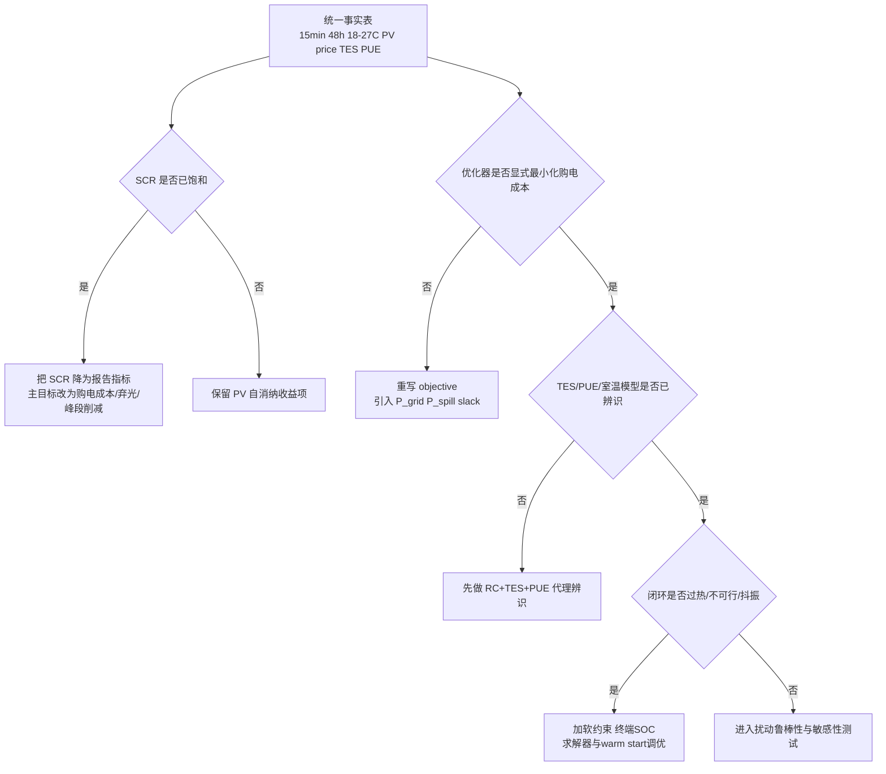
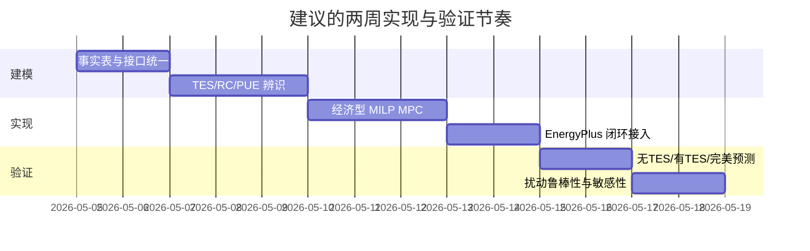

# 数据中心 EnergyPlus 加简化 TES 的 MPC 时间套利排查与实现报告

## 执行摘要

结合你给定的系统约束，以及我对你上传代码包的静态检查，我对问题的判断是：现在“agent 学不会利用 TES 做时间套利”大概率不是单一超参数问题，而是**目标函数、状态模型、可控自由度、PUE 处理、以及与 EnergyPlus 的同步接口**同时存在失配。EnergyPlus 的 `ThermalStorage:ChilledWater:Mixed` 本质上是**单节点、充分混合**的冷水蓄能模型，源侧换热、用侧换热和环境热损失都进入同一能量平衡；如果外层 MPC 没有把这些项折算成可预测的状态转移和购电成本，TES 在优化里就会退化成“阀位切换器”，而不是“可套利的能量库存”。同时，PUE 的定义是总设施能耗除以 IT 能耗；在 IT 负载近似给定时，**直接最小化购电成本/设施能耗**通常比直接最小化 PUE 比值更稳、更容易得到凸近似。citeturn9view0turn21view2turn21view4turn9view5

你的系统设定本身并不妨碍 TES 做时间套利：15 分钟控制步长足够细，48 小时预测窗口也足以跨越“谷段预充—峰段放冷”的日际边界；EnergyPlus 也支持通过 Runtime API 和 Data Transfer API 在运行中读取传感器、写入执行器，并提供多个回调点用于逐步闭环控制。问题更像是：**套利信号没有被正确地写进优化问题**，或者写进去了，但被错误的状态近似、温控约束、PUE 代理、或者接口时序错误淹没了。citeturn20view0turn9view2turn9view3turn22view0

从工程实现上，我建议你不要继续把“是否学会了 TES”寄托在 RL 奖励能否自己涌现上，而是先完成一个**可审计、可复现实验的经济型 MPC 基线**：把变量统一成“购电功率、弃光功率、TES 充放冷功率、室温状态、SOC、温控松弛变量、SOC 松弛变量”，目标函数显式最小化**分时电费 + 弃光惩罚 + TES 循环成本 + 温控违约罚 + SOC 违约罚**。当模型和接口都稳定后，再决定是否把它当成 RL teacher、BC warm-start，或者直接作为最终控制器。已有相关数据中心和中央冷站研究表明，当 MPC 显式建模储能状态、设备性能和经济目标时，成本下降是可以验证的；相反，如果只有局部自由度或没有设备能耗模型，收益会迅速消失。citeturn9view6turn16view3turn9view8turn9view7

我给你的落地策略分成两层：第一层是**排查**，目标是定位“套利信号到底断在哪”；第二层是**重构**，目标是最晚在下一轮实验中得到一个可解释的 TES 套利闭环。最后附上一份**可直接交给 Codex 的任务清单和最终 prompt**，包括接口、模块边界、求解器设置、日志、可视化和测试用例。

## 已知系统与关键假设

下表把你已经明确给出的系统事实，与我建议的实现口径放到一张“事实表”里。这一步非常重要，因为当前这类问题最常见的失败模式不是算法弱，而是**事实表不一致**：论文写的是 48 小时窗口，代码默认还是 24 小时；约束写的是 27°C，上游 reward 或 summary 还在按 25°C 判罚；价格写的是江苏 2024，脚本读的却是另一份 CSV。

| 项目 | 已知系统与目标 | 建议实现口径 |
|---|---|---|
| MPC 步长 | 15 分钟 | 固定为 4 step/h，不再让内部脚本自行覆盖 |
| 预测窗口 | 48 小时 | 固定为 192 step，终端约束也要按 48 小时窗口设计 |
| 室温约束 | 18–27°C | 在优化中用**硬约束 + 软松弛变量**；报告中同时输出违约次数与 degree-hours |
| PV 输入 | 真实年度 PV 数据，先做 ±5% 扰动，后做更大扰动 | 先把小时级数据重采样为 15 分钟，再叠加乘性扰动；统一记录随机种子 |
| 电价 | 江苏 2024 典型峰谷阶梯电价；不参与市场化交易 | 将价格视为**外生时变参数**，按时间戳映射到 15 分钟，不在优化中把价格设成决策变量 |
| TES | EnergyPlus 参考的简化模型 | 先做控制导向线性化；保留与 EnergyPlus 原对象一一对应的参数表 |
| PUE | 由 EnergyPlus 根据外温与设备性能计算 | 第一版不直接把 PUE 比值作为主目标；推荐“外生预测 + 在线偏差修正” |
| 优化目标 | 学会 TES 时间套利，并兼顾温控与 PV 自消纳 | 显式最小化分时购电成本，同时惩罚弃光、循环和违约，而不是只靠归一化价格 proxy |

### TES 需核对参数表

下面这张表是你最应该先对齐的参数清单。前两列是**必须核对**的控制导向参数；第三列是**如果你当前仍在使用上传模型**时，我从本地 epJSON/脚本中读到的现值；第四列给出替换方法。这里我把“EnergyPlus 对象参数”和“外层控制器参数”放在一起，因为两者只要有一个不对，就会出现“物理能充，但优化看不见”的假象。EnergyPlus 官方文档明确，`ThermalStorage:ChilledWater:Mixed` 的关键字段包括储罐体积、充冷设定点、死区、最小温度限制、名义制冷能力、环境边界、源侧/用侧效果系数与可用性等。citeturn9view0turn21view4

| 参数 | 作用 | 你上传模型中的当前值 | 如何替换为真实值 |
|---|---|---|---|
| `tank_volume` | 决定 TES 能量容量上限 | 1400 m³ | 直接改 epJSON；并同步重算 `E_cap` |
| `setpoint_temperature_schedule_name` | 触发源侧充冷请求 | 6°C 对应 schedule | 若真实策略不是恒定 6°C，改为时变 schedule |
| `deadband_temperature_difference` | 决定 cut-in/cut-out | 0.5°C | 与控制器中的充放冷切换带统一 |
| `minimum_temperature_limit` | 物理下限，防止过冷 | 1°C | 若现场更保守，应抬高 |
| `nominal_cooling_capacity` | 影响可充冷速率与恢复能力 | 9.767 MW 量级 | 从设计工况或仿真标定更新 |
| `ambient_temperature_indicator` | 决定热损失边界 | Zone | 若实际更接近机房/设备间，应改边界 |
| `ambient_temperature_zone_name` | 环境热交换对象 | DataCenter ZN | 按真实模型替换 |
| `heat_gain_coefficient_from_ambient_temperature` | 站立损失 / 热泄漏 | 282 W/K | 用回放辨识或设计参数更新 |
| `use/source_side_heat_transfer_effectiveness` | 充放冷有效性 | 1.0 / 1.0 | 若发现充放冷不对称，分别校正 |
| `use/source_side_design_flow_rate` | 最大充放冷流量 | Autosize | 建议落成显式数值，避免“自动尺寸”改变控制等效模型 |
| `tank_recovery_time` | 充冷恢复速度 | 4 h | 与外层 horizon/terminal policy 联动更新 |
| EMS 最大流量 | 影响每步 SOC 变化斜率 | 脚本里约 389 kg/s | 从 EnergyPlus EMS 或 plant loop 真实限值核对 |
| 初始 SOC | 决定前几小时是否可套利 | 需运行时读取 | 必须从 E+ 传感器实时初始化，不能写死 |
| SOC 安全带 | 防止过充/过放 | 代码中 guard 常见为 0.10–0.90 | 与物理边界区分：物理带 vs 规划带 |
| 规划带 | 允许优化使用的 SOC 带 | 代码里常见 0.15–0.85 | 作为 MPC 软边界更稳 |

### 未指定项与真实值替换步骤

下面这些项你在问题里没有给定，但它们会直接决定是否能看到套利：

1. **TES 的真实容量是按体积算，还是按“有效冷量窗口”算。**  
   替换步骤：先用体积、供回水温差、密度和比热算理论容量，再用一周回放辨识得到“有效容量”，二者都写入配置，优化用后者，报告同时给出二者。

2. **PUE 是直接用 EnergyPlus 报表后处理，还是要进入 MPC 的预测模型。**  
   替换步骤：第一版只在日志里输出 `PUE_actual`，同时拟合 `PUE_hat(T_oa, load, mode)`；等残差稳定后再接入优化。

3. **价格文件是否已经是 2024 最终版。**  
   你上传的本地价格文件格式示例是 `timestamp,price_usd_per_mwh`；如果你最终要用 2024，就保留这个 schema、不保留其中数值。

4. **你现在跑的是否就是上传那版控制器。**  
   如果是，我下面“当前学不会的高概率根因”优先级极高；如果不是，就把那张表当排查模板，而不是当已经确定的事实。

## 为什么当前 agent 学不会利用 TES 做时间套利

### 基于你上传代码包的静态检查结论

如果你当前运行的控制器和上传包一致，那么下面这些不是“可能”，而是**非常高概率的直接原因**：

| 静态检查观察 | 当前实现形态 | 直接后果 |
|---|---|---|
| 预测窗口默认值仍是 24 小时 | 代码默认 `horizon_hours=24` | 即使你论文设定写 48 小时，实际运行可能看不到跨日套利边界 |
| 外层控制实际上只优化 TES | CRAH 风机、冷却塔泵、CRAH/Chiller 温度大多固定插入 | TES 充冷引起的额外冷机能耗无法被上层共同补偿，套利空间被压扁 |
| 目标函数主要是归一化电价 proxy | 更像“低价充/高价放”的规则加强版，而不是实际购电成本最小化 | 学到的是阈值切换，不是经济最优库存管理 |
| PV 没进入 planning objective | PV 可能只在 reward 或日志出现 | 无法形成“白天充冷吸纳 PV、晚上卸冷降电费”的闭环经济信号 |
| comfort risk 在优化里基本是占位项 | 代码中存在 placeholder 迹象 | 控制器可能通过牺牲温控去换取伪套利，最后既不省钱也不稳 |
| PUE 主要用于 summary，不在优化环 | 只做结果统计 | TES 的真实冷机效率代价不会在求解时显式体现 |
| 温控口径可能不一致 | 上传脚本里存在 18–25°C 的痕迹，而你当前目标是 18–27°C | 优化、reward、评估三套口径可能互相打架 |

这类实现的共同问题是：**代理学到的不是“什么时候把冷量当库存”，而是“什么时候把阀门拨到另一个方向”**。而真正的时间套利一定依赖四个要素同时存在：  
一是**库存状态**可观测且可预测；  
二是**未来价差**进入成本；  
三是**充冷代价**被显式扣除；  
四是**温控/PUE 代价**没有被遮蔽。  
只缺一个，TES 都会表现为“会动，但不赚钱”。已有研究在把动态电价、TES 状态和设备能耗同时写入 MPC 后，才能稳定得到可解释的成本下降与温控改进。citeturn9view6turn16view3turn9view8turn9view7

### 你这个问题最常见的真实根因

第一类根因是**奖励错位**。  
如果目标函数没有显式最小化 `grid_import_cost`，而只是用了归一化价格、高低价阈值、预峰窗口奖励之类 proxy，那么优化器只能学会“看时间段切状态”，而学不会“权衡充冷成本、热损失、未来峰价、当前户外温度造成的 PUE 变化”。这也是为什么你会看到“充得出来、也放得出来，但账单没有更好”。citeturn9view5turn9view8turn16view3

第二类根因是**物理模型过弱**。  
EnergyPlus 的混合冷水罐并不是一个无损能量箱，它同时受环境热交换、源侧与用侧换热、死区和设定点策略影响。官方工程参考明确给出了环境损失项和源/用侧换热项如何进入微分方程。若外层只用“阀位→SOC 线性斜率”的极简近似，而没有把热损失、充放冷效率、最大速率、初始 SOC、回水温/外温相关效应并入，优化器会系统性高估 TES 套利价值。citeturn21view0turn21view2turn21view3turn21view4

第三类根因是**PUE 处理错位**。  
PUE 是总设施能耗与 IT 能耗的比值。对大多数数据中心控制问题，如果 IT 负载外生给定，真正该优化的是**设施总购电功率**，而不是直接拿比值做主目标。把比值直接塞进优化会增加非线性和数值脆弱性；更稳的做法是先优化 facility electricity，再把 PUE 作为结果指标、软正则项，或外生代理模型。citeturn9view5turn9view4

第四类根因是**PV 指标设错**。  
如果全年任一时刻的 PV 发电都低于建筑负荷，那么 `self-consumption rate` 会天然接近 100%，这时 TES 不可能再提升 SCR；你应该改看 `PV load coverage`、`grid import reduction` 和 `peak-hour cost reduction`。这不是算法失败，而是指标饱和。

第五类根因是**闭环时序错位**。  
EnergyPlus 的 Python Runtime API 允许在多个回调点读写数据，但变量/执行器句柄不是一启动就全可用，官方也明确提醒要在初始化后、合适的 callback 里完成数据交换。再加上 `Timestep` 对象控制的是 zone timestep，而 system timestep 还可能在内部自动收缩；如果你在错误的回调点采样、求解和施加动作，很容易出现“观测属于上一时刻，动作落到下一系统迭代”的隐性延迟。citeturn9view3turn20view0turn22view0



## 排查清单

下面这张表是我建议你立刻执行的逐项排查单。顺序已经按优先级排好，建议不要跳步。因为前四项如果没过，后面再调 solver 和画图都没有意义。

| 检查项 | 输入 | 预期输出 | 排查方法 | 优先级 |
|---|---|---|---|---|
| 事实表一致性 | 代码默认值、论文设定、运行脚本参数 | 一张唯一 truth table | 对 `dt`、horizon、温度上限、price csv、pv csv、TES 参数、PUE 口径做逐项比对；凡是“文档写法 ≠ 运行默认值”都改成配置显式覆盖 | 最高 |
| TES 参数一致性 | epJSON、EMS、wrapper 参数 | 一套可用于控制的 TES 参数字典 | 提取罐体积、设定点、死区、UA、最大流量、恢复时间、SOC guard/planning band，统一落到 `tes_config.yaml` | 最高 |
| 初始 SOC 与 SOC 传感器 | EnergyPlus 监测点、wrapper 观测 | `soc0` 真实、连续、无跳变 | 连续画 `TES_SOC`、罐温、阀位，检查 `ΔSOC` 与阀位符号一致性；若不一致，先修映射，不进优化 | 最高 |
| TES 动力学辨识 | 一周以上 monitor | `s_{t+1}=f(s_t,u,T_oa)` 的可用近似 | 对 charge/discharge 分别拟合增益与损失；至少给出 `η_ch`, `η_dis`, `λ_loss`, `Pmax_ch`, `Pmax_dis` | 最高 |
| 室温 RC 模型 | `air_temperature`、IT 负载、室外温度、冷量/执行器 | 1R1C 或 2R2C 状态模型 | 用回放数据辨识；如果模型误差大于 0.5–1.0°C RMSE，别把温度硬约束直接交给它 | 高 |
| PUE 耦合方式 | `Electricity:Facility`、ITE 电耗、外温、负载、chiller 输出 | `PUE_hat` 或 `P_fac_hat` | 先拟合外生模型，再用近 4–8h 做在线偏差修正；若残差仍系统偏移，再升级耦合模型 | 高 |
| 目标函数经济性 | 价格、PV、IT 负载、TES/冷机功率 | 每项成本分解可审计 | 检查 objective 是否真的最小化 `price * grid_import`；若还是 price proxy，立即重写 | 高 |
| PV/电价接口 | 小时级 CSV、扰动脚本 | 15 分钟外生时序 | 对齐时区、时间戳、夏冬时段；PV 用统一重采样策略；价格用 stepwise constant 映射 | 高 |
| EnergyPlus–MPC 同步 | callback 选择、句柄初始化、warmup | 每步只求解一次，每步只施加一次动作 | 用 callback 日志打印“读数时刻 / 求解时刻 / 写入时刻”；发现一对多或多对一立即修 | 高 |
| 约束可行性 | 温控、SOC、速率、终端 SOC | 求解器最优或至少可行 | 增加温控与 SOC 松弛变量，记录 slack；任何 infeasible 都必须落盘并画 IIS 替代诊断 | 中高 |
| 阶梯/峰谷价格建模 | 时间段表、价格 CSV | `price_buy[t]` 序列正确 | 如果只是 TOU，直接预先展开；只有月度需量/累进阶梯才需要额外 piecewise 变量 | 中高 |
| 求解器和 warm start | 上一步解、日志、求解时间 | 192 step 可在可接受时间内求解 | 先 MILP + HiGHS；启用 shifted warm start；每步记录 gap、solve time、status | 中 |
| 日志与可视化 | monitor、solver log、cost breakdown | 一眼可判定套利是否存在 | 必画：价格/SOC/阀位、负荷/PV/电网、温度、PUE、单步 cost breakdown、solver status | 中 |
| 扰动鲁棒性 | ±5%、±10%、±20% 场景 | 成本与违约曲线 | 先 deterministic rolling MPC，再做三场景法，再做 chance constraints | 中 |

## 改进实现方案

### 推荐的总体控制架构

我建议你把闭环改成一个**经济型滚动优化 MPC**，而不是“温度控制 + 阈值式 TES”。核心思想是：  
在每个 15 分钟时刻，先从 EnergyPlus 读当前状态，再用 48 小时预测生成**价格、PV、外温、IT 负载**，然后求解一个最小化**购电成本 + 弃光 + 循环 + 违约**的优化问题，只把第一个控制动作施加回 EnergyPlus。这个流程与 MPC 的标准滚动优化思想一致，也和建筑能耗领域常见的 robust/stochastic MPC 实践一致。citeturn9view9turn16view0turn16view1turn16view2

推荐你第一版就采用下面这组变量：

- **状态变量**：室温状态 `x_t`、TES SOC `s_t`
- **控制变量**：TES 充冷功率 `q_ch[t]`、TES 放冷功率 `q_dis[t]`、可选的 CRAH 送风温度/冷机出水温设定值
- **辅助变量**：电网购电 `P_grid[t]`、弃光 `P_spill[t]`、温控松弛 `εT[t]`、SOC 松弛 `εs[t]`
- **可选二进制变量**：`z_ch[t]`、`z_dis[t]`，防止同时充放冷

建议的目标函数写成：

\[
\min \sum_{t=0}^{N-1}\Delta t \Big(
\pi_t^{buy} P_t^{grid}
+ c^{spill} P_t^{spill}
+ c^{cyc}(q_t^{ch}+q_t^{dis})
+ c^{sw}\,\xi_t
+ \rho_T(\epsilon_{t}^{T,+}+\epsilon_{t}^{T,-})
+ \rho_s \epsilon_t^s
\Big)
+ \rho_f \epsilon_T^{term}
\]

其中最关键的是这个功率平衡：

\[
P_t^{grid}-P_t^{spill}=P_t^{facility}-P_t^{pv}
\]

只要你没有上网收益，最小化 `P_grid` 并惩罚 `P_spill`，就已经把“电价套利”和“PV 自消纳”统一进同一目标里了，不需要再单独发明一个藕合很差的“PV 奖励”。这比当前很多 rule-enhanced MILP 更稳。

### TES 模型应该怎么建

EnergyPlus 官方文档告诉我们，混合冷水蓄能模型是单节点、充分混合，并受环境热损失、源侧和用侧换热共同影响。对控制器来说，最有用的不是把所有热力学细节一股脑搬进去，而是建立一个**控制导向的简化模型**。citeturn9view0turn21view0turn21view2turn21view4

我建议你按下面三层做：

| 建模层次 | 数学形式 | 优点 | 缺点 | 推荐用途 |
|---|---|---|---|---|
| 线性 SOC 模型 | `s_{t+1}=(1-λ_loss)s_t + η_ch q_chΔt/E_cap - q_disΔt/(η_dis E_cap)` | 快、稳、最容易接 MILP | 不能自然表达复杂设备曲线 | 第一版必须有 |
| MILP 模式约束 | 上式 + `q_ch <= z_ch M`, `q_dis <= z_dis M`, `z_ch+z_dis<=1` | 彻底消除同时充放冷伪解 | 增加二进制变量 | **我推荐的第一版主方案** |
| 非线性温度模型 | 直接以罐温、回水温、流量、设备曲线建模 | 更接近真实 EnergyPlus | 求解更慢、调试更难 | 第二阶段再上 |

为什么我推荐 **MILP 而不是一开始就 CasADi NMPC**？  
因为你当前最痛的不是非线性不够，而是**问题定义错位**。只要先把“购电成本—弃光—温控—SOC”四者写对，并用二进制变量防 simultaneous charge/discharge，你就能很快知道 TES 有没有真实套利空间。等这一版跑通后，再把 chiller EIR 曲线、冷却塔效率、PUE 代理加进 CasADi 非线性层。中央冷站调度研究里，TES 与 chiller/pump 的联合优化常常会从简化储能状态和设备约束入手，再逐步增加性能曲线细节。citeturn16view3turn9view7

### PUE 随外温变化应该怎么处理

PUE 的本质是指标，不是天然适合直接做优化主目标的控制量。行业定义上，PUE 是总设施能耗除以 IT 能耗；在 IT 负载给定时，直接最小化设施电耗，通常就已经在最小化 PUE 了。citeturn9view5

你可以在实现里选三种方案：

| 方案 | 做法 | 优点 | 风险 | 我的建议 |
|---|---|---|---|---|
| 外生预测 | 离线拟合 `PUE_hat = f(T_oa, season, IT load, maybe load ratio)` | 实现最简单，数值最稳 | 忽略 TES/设备瞬态耦合 | **短期首选** |
| 在线估计 | 用 EWMA / RLS / Kalman 对 `PUE_hat` 做偏差修正 | 能追踪漂移 | 需要干净日志和稳态识别 | **与外生预测一起用** |
| 耦合状态扩展 | 把冷机功率或 facility power 作为额外状态/代数方程纳入 MPC | 最准确 | 模型和求解明显更重 | 第二阶段 |

我的推荐不是三选一，而是：  
**先用“外生预测 + 在线偏差修正”的半耦合方案。**

具体做法：

1. 先从 EnergyPlus 输出拟合  
   \[
   P_t^{facility} = P_t^{IT} + \hat P_t^{aux}(T_{oa},IT,season) + \hat P_t^{cool}(Q_t^{chiller},T_{oa})
   \]
2. 再在线更新一个偏差项  
   \[
   b_t = \alpha b_{t-1} + (1-\alpha)(P_t^{facility,actual}-P_t^{facility,pred})
   \]
3. MPC 内使用 `P_fac_hat + b_t`  
4. 报告里继续输出真实 `PUE_actual`，但不把它作为主优化目标

这样做的好处是：你既利用了外温对设备效率的影响，又避免把“比值目标 + 非线性性能曲线 + 二进制模式”一次性塞进一个脆弱的大模型。EnergyPlus 也提供了运行时读写接口和 chiller 相关输出，用来离线标定这类 proxy model 完全够用。citeturn20view0turn9view2turn14view0

### 时间套利目标应该怎么写进 MPC

请把下面这件事当成核心改造原则：

**不要再把“高价阈值/低价阈值”当成时间套利的主体；它们最多只能做辅助先验。**

真正的套利目标必须显式写成：

1. **购电成本**  
   `price_buy[t] * P_grid[t]`

2. **PV 自消纳 / 弃光代价**  
   `c_spill * P_spill[t]`

3. **TES 充放冷代价**  
   包括泵耗、电机附加能耗，或等效循环成本 `c_cyc(q_ch+q_dis)`

4. **温控与 SOC 违约**  
   大罚项，不允许用“约束外套利”伪造收益

5. **切换惩罚**  
   减少抖振，避免每 15 分钟切模式

如果你愿意保留阈值信号，也只能保留为**终端参考**或**候选启发式 warm-start**，而不能再作为 cost proxy 本体。

### 约束应该怎么处理

推荐的约束集合是：

- **室温约束**  
  \[
  18-\epsilon_t^{-} \le T_t^{room}\le 27+\epsilon_t^{+}
  \]
  `ε` 要进入目标函数，并单独统计次数与 degree-hours

- **SOC 约束**  
  物理边界：`s_min_phys <= s_t <= s_max_phys`  
  规划边界：`s_min_plan - εs <= s_t <= s_max_plan + εs`

- **充放冷速率约束**  
  \[
  0\le q_t^{ch}\le \bar q^{ch},\quad 0\le q_t^{dis}\le \bar q^{dis}
  \]

- **互斥约束**  
  \[
  q_t^{ch}\le z_t^{ch} M,\quad q_t^{dis}\le z_t^{dis} M,\quad z_t^{ch}+z_t^{dis}\le 1
  \]

- **终端 SOC 约束不要写死常数**  
  最好写成“与未来峰段/下一谷段相关”的 time-varying terminal target，而不是固定 0.5 或 0.6

- **价格建模**  
  如果是按时间戳确定的峰/平/谷/尖峰，那就是**已知参数**，不需要为价格本身再引入整数变量。只有当你把月度需量电费、累进阶梯电量、或 demand charge 真正一并纳入时，才需要额外的 piecewise 变量。官方 EnergyPlus 文档也提醒，若涉及电价/需量窗口，时间步应与计费窗口保持一致；你的 15 分钟步长恰好适合 quarter-hour 窗口。citeturn22view0

### 预测误差鲁棒性怎么做

我不建议你第一版就做全窗口大场景树，那会把 48 小时、192 step 的 MILP 直接做炸。更实用的顺序是：

1. **滚动优化 + 软约束**  
   先跑 deterministic MPC，确认闭环真实能套利

2. **保守约束**  
   对最敏感的温控约束做 tightening，例如把 27°C 实际要求在优化里当 26.5°C

3. **短窗场景法**  
   只对未来 4–8 小时引入 3 个场景：`nominal / pessimistic / optimistic`

4. **chance-constrained MPC**  
   如果你已稳定拿到 RC 与 PUE 预测残差分布，再把概率约束用于温控和 SOC。建筑领域已有相关工作表明，考虑不确定性的 chance-constrained MPC 往往以较小额外成本换来显著更稳的舒适性与可行性；`do-mpc` 也明确支持多阶段 robust MPC 形式。citeturn16view1turn16view2turn16view0turn9view9

## 仿真与验证计划

验证计划不要只看“年总电费”，否则很多伪套利会被平均掉。你必须把**机制正确性**和**经济正确性**分开测。

### 测试用例矩阵

| 用例 | 目标 | 关键设置 | 预期用途 |
|---|---|---|---|
| 无 TES 基线 | 建立电费、PUE、温控基线 | TES 全程禁用 | 判断 TES 是否真的创造价值 |
| 有 TES、完美预测 | 验证理论可套利上界 | 无预测误差 | 判断模型与目标是否写对 |
| ±5% PV 扰动 | 对齐你当前主设定 | PV 乘性扰动，固定种子 | 首轮鲁棒性对照 |
| ±10% 扰动 | 测中等预测误差 | PV 与外温/PUE 残差一起扰动 | 看收益是否快速衰减 |
| ±20% 扰动 | 压力测试 | 大扰动 + 滚动优化 | 判断是否需要 chance constraint |
| 炎热天气周 | 检查 PUE 恶化条件下是否还套利 | 选高外温周 | 看 TES 充冷成本是否被低估 |
| 温和天气周 | 检查 TES 是否还有必要 | 选低外温周 | 看策略是否自动减少 TES 使用 |
| 无 PV 与有 PV 对比 | 区分价差套利与 PV 吸纳 | 关/开 PV | 判断两类收益来源 |
| 阶梯电价敏感性 | 判断套利对价差的依赖 | 基准、缩小、放大价差 | 判定“物理没空间”还是“目标没写对” |

### 必须输出的性能指标

建议每个用例至少输出以下指标：

- 年/周总电费
- 峰段电费、谷段电费、总购电量
- PV 自消纳率
- PV 负荷覆盖率
- 弃光量
- 室温违约次数
- 室温违约 degree-hours
- TES 日循环次数或等效 throughput
- SOC 越界次数
- 平均 PUE、95 分位 PUE、峰段 PUE
- 求解器最优率、平均求解时间、不可行次数

### 建议绘图

至少画这六类图：

1. **时间序列图**：价格、SOC、TES 充放冷、室温  
2. **能量流堆叠图**：IT、冷却、PV、购电、弃光  
3. **成本柱状图**：总电费、峰段电费、谷段电费  
4. **TES 机制图**：峰前 `ΔSOC` 与峰段 `ΔSOC`  
5. **PUE 影响图**：外温 vs PUE / 设施电耗  
6. **鲁棒性曲线**：扰动幅度 vs 电费增量 / 违约率 / 求解失败率



## 可复用文献与开源实现

如果你的目标是“本周就把可解释的 TES 套利闭环做出来”，我建议优先复用下面这些资源，而不是在仓库里继续堆启发式规则。

首先是 **EnergyPlus 官方文档**。  
你最需要看的不是泛泛教程，而是四个点：`ThermalStorage:ChilledWater:Mixed` 的 schema、混合水箱的工程参考方程、`Timestep` 与 system timestep 的关系、以及 Runtime/Data Transfer API 的 callback 与 sensor/actuator 机制。前两者决定你的 TES 简化模型是否站得住，后两者决定闭环时序是否正确。citeturn9view0turn21view0turn21view4turn20view0turn9view2turn9view3turn22view0

其次是 PUE 的定义资料。  
我建议把 entity["organization","The Green Grid","data center consortium"] 的 PUE 文档当成你的指标口径来源：它把 dedicated facility 的 PUE 定义得很清楚，也解释了为什么 PUE 更适合作为运维/对比指标，而不是控制器一上来就直接优化的比值目标。citeturn9view5

再往下是四篇最值得借鉴的论文。  
一篇是数据中心热网/TES 的 MPC 论文，说明把动态价格与 TES 状态显式并入目标后，成本下降是可达的。citeturn9view6  
一篇是中央空调带冷蓄能的 MPC 论文，适合你借鉴“线性状态空间 + 在线优化 + 温控约束”的结构。citeturn9view7  
一篇是多冷机数据中心 MPC 论文，适合你借鉴“整体能量守恒约束”和“温度预测 + 设备协同”的建模思路。citeturn9view8  
一篇是机场中央冷站 chiller + TES 调度论文，适合你借鉴“先用简化 TES 状态，再逐步引入设备曲线”的分层实现路线。citeturn16view3

在开源工具上，我的建议是分层使用。  
`do-mpc` 很适合你后续做**多场景 robust MPC**，因为它原生支持 multi-stage robust 形式。citeturn9view9  
`CasADi` 很适合第二阶段做**连续非线性 MPC**，例如把 chiller EIR、PUE 代理、回水温影响一起写进去。citeturn9view10  
`GEKKO` 适合你想快速搭一个混合整数/非线性混合原型，但我不建议拿它做第一版生产闭环。citeturn9view11  
现成代码方面，可以参考 `MPC-for-EnergyPlus-Python-API` 这个 entity["company","GitHub","software hosting"] 仓库的 API 对接方式。citeturn9view12

如果你未来要把控制层做得比 EnergyPlus 原生 HVAC 表达力更强，可以看 entity["organization","Lawrence Berkeley National Laboratory","Berkeley CA US"] 和 entity["organization","National Renewable Energy Laboratory","Golden CO US"] 共同推进的 Spawn / Modelica Buildings 路线。Spawn 的意义不在于你现在马上迁移，而在于它证明了：**EnergyPlus 负责围护/负荷，Modelica 负责 HVAC 与控制**，这种分工对于复杂能源系统和储能控制是成立的。OpenModelica 的 Buildings 库里也已经有 `ChillerPlant` 和带储能的 hydronic heating 示例，可直接借鉴模块边界和日志组织方式。citeturn23view2turn23view0turn23view1

## 交给 Codex 的任务清单与 Prompt

### Codex 任务清单

| 任务 | 输入 | 预期输出 | 实现要点 | 测试用例 |
|---|---|---|---|---|
| 统一配置与 schema | 现有 price/pv csv、epJSON、脚本参数 | `config/base.yaml`、`schemas.py` | 所有运行参数显式化，禁止隐式默认值覆盖论文设定 | 读取配置后打印 truth table |
| 建立 EnergyPlus 适配层 | 现有 Python API / wrapper | `eplus_adapter.py` | 固定 callback：读数在 timestep 末，写入在下一步开始；处理 warmup 和 handle ready | 96 step dry-run，无重复求解 |
| 数据预处理与预测接口 | 小时级 PV/price、天气预测 | `forecast.py` | 统一重采样到 15 分钟；PV 扰动可控；价格按时段展开 | 对齐 1 天数据可视化检查 |
| TES / 室温 / PUE 识别 | monitor.csv | `identify_tes.py`, `identify_rc.py`, `identify_pue.py` | 拟合 TES 有效容量、效率、损失；拟合 1R1C/2R2C；拟合 PUE 或 facility power proxy | 输出 RMSE、MAE、参数文件 |
| MILP 问题构造 | 参数文件、预测时序、当前状态 | `mpc_problem_milp.py` | 变量含 `P_grid/P_spill/q_ch/q_dis/s/T/slack`；支持互斥充放冷 | 单步求解 status=optimal |
| 闭环控制器 | 适配层 + MILP | `controller.py` | 48h horizon、15min receding horizon、warm start、terminal SOC | 96 step 闭环 cost 可分解 |
| 日志与可视化 | monitor、result、solver log | `plot_results.py`, `report_metrics.py` | 至少输出 6 类图和 cost breakdown | 一条命令生成图与 markdown 总结 |
| 验证与场景批处理 | 预测扰动、价差敏感性 | `run_validation_matrix.py` | 跑无 TES / 有 TES / 扰动 / 天气情景 / 价差敏感性 | 自动产出总表 CSV+MD |

### 推荐求解器与参数

**第一版推荐**

- 模型：线性 MILP
- 求解器：HiGHS  
- 变量：连续变量 + 每步 2 个二进制充放冷模式  
- horizon：192 step  
- time limit：30–60 s / step（离线仿真可以更高）  
- relative gap：`1e-3` 到 `5e-3`  
- warm start：使用上一步解向前平移  
- infeasible 处理：保留温控和 SOC slack，不允许 silent fallback

**第二版推荐**

- 模型：连续非线性 NMPC
- 建模：CasADi
- 求解器：IPOPT
- `tol=1e-6`，`acceptable_tol=1e-4`，`max_iter=300`
- 仅在 MILP 版已经证明“确实存在套利且机制正确”后再上

### 示例伪代码

```python
# mpc_main_loop.py

state = eplus_adapter.initialize()
models = load_models("artifacts/identified_models/")
controller = EconomicTESMPC(models, horizon_steps=192, dt_h=0.25)

while not eplus_adapter.done(state):

    # 1) 在 timestep 末尾读取当前观测
    y = eplus_adapter.read_observation(state)
    # y should include:
    # timestamp, air_temperature_C, outdoor_drybulb_C, ite_power_kw,
    # facility_power_kw, tes_soc, tes_tank_temp_C, current_pv_kw,
    # chiller_cop, current_price_usd_per_mwh

    # 2) 更新估计器 / 偏差修正
    est = update_estimators(y)

    # 3) 构建未来 48h 预测
    pred = build_forecast(
        now_ts=y["timestamp"],
        horizon_steps=192,
        pv_mode="scenario_or_nominal",
        price_mode="deterministic_csv",
        weather_mode="forecast_or_replay",
        pue_bias=est["pue_bias"]
    )

    # 4) 构造优化问题
    problem = controller.build_problem(
        x0_room=est["room_state"],
        s0_tes=y["tes_soc"],
        forecasts=pred,
        constraints={
            "T_min": 18.0,
            "T_max": 27.0,
            "soc_min_phys": 0.10,
            "soc_max_phys": 0.90,
            "soc_min_plan": 0.15,
            "soc_max_plan": 0.85
        }
    )

    # 5) 求解
    sol = controller.solve(problem)

    # 6) 只执行第一个动作
    u0 = sol.first_action()
    # u0 should include:
    # tes_charge_kwth, tes_discharge_kwth, tes_signed_target,
    # optional crah_supply_temp_sp_C, chiller_lwt_sp_C

    # 7) 在下一步开始时写回执行器
    eplus_adapter.write_action(state, u0)

    # 8) 记录日志
    log_step(y, pred, sol, u0)

finalize_report()
```

### EnergyPlus I/O 接口定义建议

```python
# observation schema
{
  "timestamp": "2025-07-01T12:15:00",
  "dt_h": 0.25,
  "air_temperature_C": 24.3,
  "outdoor_drybulb_C": 33.7,
  "ite_power_kw": 18500.0,
  "facility_power_kw": 22380.0,
  "tes_soc": 0.62,
  "tes_tank_temp_C": 7.1,
  "current_pv_kw": 4120.0,
  "current_price_usd_per_mwh": 158.0,
  "chiller_cop": 5.8,
  "pue_actual": 1.2097
}
```

```python
# action schema
{
  "tes_signed_target": -0.35,
  "tes_charge_kwth": 2800.0,
  "tes_discharge_kwth": 0.0,
  "crah_supply_temp_sp_C": 20.0,
  "chiller_lwt_sp_C": 6.5,
  "ct_pump_speed_frac": 0.85
}
```

### 外部数据文件格式与示例行

```csv
# pv_annual.csv
timestamp,power_kw
2025-01-01 00:00:00,0.0
2025-01-01 01:00:00,0.0
2025-01-01 12:00:00,3865.2
```

```csv
# tou_price.csv
timestamp,price_usd_per_mwh
2025-01-01 00:00:00,29
2025-01-01 08:00:00,158
2025-01-01 19:00:00,190
```

### 给 Codex 的最终 Prompt

```text
你现在是仓库内的实现代理。目标是在不破坏现有 EnergyPlus 仿真链的前提下，新建一个可审计的 economic MPC v2，用于数据中心冷却系统中的简化 TES 时间套利控制。不要继续扩展启发式规则。直接实现一套新的、模块化的 MPC 闭环。

总体要求：
1. 控制步长固定 15 分钟。
2. 预测窗口固定 48 小时，即 192 step。
3. 室内空气温度约束为 18–27°C，但必须带软约束松弛变量，并输出违约次数与 degree-hours。
4. PV 使用年度真实 PV 数据，先支持 ±5% 扰动，再支持 ±10% 和 ±20%。
5. 电价视为用户不参与市场化交易的外生 TOU 价格输入，不把价格当成决策变量。
6. TES 使用控制导向简化模型，至少包含：有效容量、充电效率、放电效率、站立损失、最大充冷速率、最大放冷速率、初始 SOC。
7. PUE 不作为主目标直接优化。第一版用 facility power / PUE 的代理模型进入成本估计，并保留真实 PUE 日志输出。
8. 输出必须包括：总电费、峰段电费、PV 自消纳率、PV 负荷覆盖率、弃光量、温度违约次数、TES 循环次数、平均 PUE、峰段 PUE、求解器时间与状态。
9. 所有关键参数必须配置化，不能依赖隐式默认值。
10. 如果仓库现有控制器结构不适合重构，创建新目录 mpc_v2/，不要覆盖原始实现。

交付物：
A. mpc_v2/config/
- base.yaml
- scenario_sets.yaml
- io_schema.yaml

B. mpc_v2/core/
- io_schemas.py
- forecast.py
- identify_tes.py
- identify_rc.py
- identify_pue.py
- tes_model.py
- room_model.py
- pue_model.py
- mpc_problem_milp.py
- controller.py
- metrics.py

C. mpc_v2/eplus/
- eplus_adapter.py
- callback_runner.py

D. mpc_v2/scripts/
- run_closed_loop.py
- run_validation_matrix.py
- plot_results.py
- build_report_tables.py

E. tests/
- test_schema.py
- test_tes_dynamics.py
- test_mpc_single_step.py
- test_forecast_resampling.py
- test_closed_loop_smoke.py

实现细则：
1. 先实现统一 schema。
   - 观测字段至少包括：
     timestamp, dt_h, air_temperature_C, outdoor_drybulb_C,
     ite_power_kw, facility_power_kw, tes_soc, tes_tank_temp_C,
     current_pv_kw, current_price_usd_per_mwh, chiller_cop, pue_actual
   - 动作字段至少包括：
     tes_signed_target, tes_charge_kwth, tes_discharge_kwth
   - 如果仓库已有 CRAH/chiller/CT pump 执行器，则预留可选设定值字段，但第一版允许仅优化 TES。

2. 数据预处理：
   - 支持小时级 pv csv 和价格 csv 输入。
   - 统一重采样到 15 分钟。
   - price 使用 stepwise constant 扩展。
   - pv 默认按平均功率解释，扩展到四个 15min 点。
   - 扰动使用乘性噪声，支持固定随机种子。

3. 模型辨识：
   - identify_tes.py：从 monitor 回放拟合 charge/discharge gain、loss、max rate、有效容量。
   - identify_rc.py：先做 1R1C，再允许 2R2C；输出参数、RMSE、MAE。
   - identify_pue.py：拟合 facility power 或 PUE proxy，解释变量至少包含 outdoor temp、IT load，可选包含 TES 流量或 chiller load。
   - 所有辨识脚本必须输出 artifacts/*.json 供控制器加载。

4. 优化问题：
   - 使用 MILP。
   - 变量至少包括：
     q_ch[t], q_dis[t], s[t], P_grid[t], P_spill[t],
     eps_T_hi[t], eps_T_lo[t], eps_soc[t],
     z_ch[t], z_dis[t]
   - 约束至少包括：
     TES 状态更新
     充放冷互斥
     最大充放冷率
     室温上下界软约束
     SOC 物理边界和规划边界
     facility power / grid / PV 平衡
   - 目标函数至少包括：
     sum(price[t] * P_grid[t] * dt)
     + c_spill * P_spill[t] * dt
     + c_cycle * (q_ch[t] + q_dis[t]) * dt
     + rho_T * (eps_T_hi[t] + eps_T_lo[t])
     + rho_soc * eps_soc[t]
     + rho_switch * absolute_action_change
     + rho_terminal * terminal_soc_slack
   - 不允许再用“高价阈值/低价阈值奖励”替代真实购电成本。
   - 如需启发式，只能用于 warm-start，不得进入最终 objective。

5. 求解器：
   - 第一优先使用 HiGHS。
   - 支持 warm start。
   - 记录 solve time, mip gap, status。
   - 如果 HiGHS 不可用，则给出清晰 fallback，但不要 silent fallback 到 heuristic。

6. EnergyPlus 接口：
   - 使用 callback 在时序上保证：先读上一步真实观测，再解 MPC，再在下一步开始时写动作。
   - 正确处理 warmup 和 handle not ready。
   - 每个 timestep 只允许一次有效求解和一次有效写入。

7. 日志与图：
   - 输出 monitor.csv, solver_log.csv, episode_summary.json
   - 生成以下图：
     价格/SOC/TES 充放冷时间序列
     负荷/PV/购电/弃光堆叠图
     成本柱状图
     温度约束与违约图
     PUE 与外温关系图
     求解器耗时与状态图

8. 验证矩阵：
   - baseline_no_tes
   - tes_mpc_perfect
   - tes_mpc_pv_g05
   - tes_mpc_pv_g10
   - tes_mpc_pv_g20
   - hot_week
   - mild_week
   - tariff_sensitivity_low
   - tariff_sensitivity_base
   - tariff_sensitivity_high

9. 输出总表字段：
   case_id, cost_total, cost_peak, cost_valley, grid_import_mwh,
   pv_total_mwh, pv_self_consumed_mwh, pv_self_consumption_rate_pct,
   pv_load_coverage_pct, pv_spill_mwh,
   temp_violation_count, temp_violation_degree_hours,
   tes_cycles_equiv, soc_violation_count,
   pue_avg, pue_p95,
   solve_time_avg_s, solve_time_p95_s, optimal_rate

10. 代码质量：
   - 所有模块写清楚 docstring。
   - 提供类型注解。
   - 提供输入校验和异常信息。
   - 不要把业务逻辑写死在 notebook 里。
   - 所有默认参数写到 yaml。
   - 先保证能跑通 smoke test，再补扩展功能。

优先级顺序：
Phase 1：schema + adapter + forecast + TES MILP 单步求解
Phase 2：RC + PUE 代理 + 96-step 闭环 smoke test
Phase 3：全年/多周场景批处理 + 图表 + summary 表
Phase 4：鲁棒场景和敏感性分析

验收标准：
- 96-step smoke test 无崩溃、无 NaN、无 silent fallback。
- `tes_mpc_perfect` 相比 `baseline_no_tes` 至少给出可解释的机制：峰前充冷、峰段放冷、成本项可分解。
- 所有图和总表可一键生成。
- 任何 infeasible 或句柄错误都要清晰报错并落日志。

如果仓库接口与以上假设不一致：
- 不要停下来问。
- 先保留原接口。
- 创建兼容层并在 README 中说明映射关系。
- 继续完成实现。
```