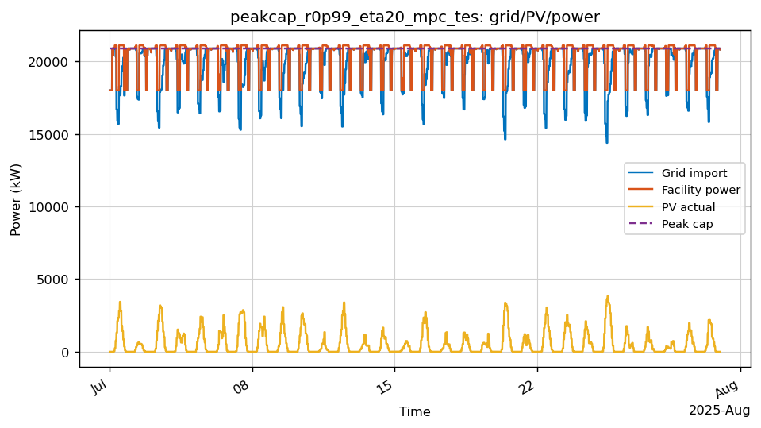
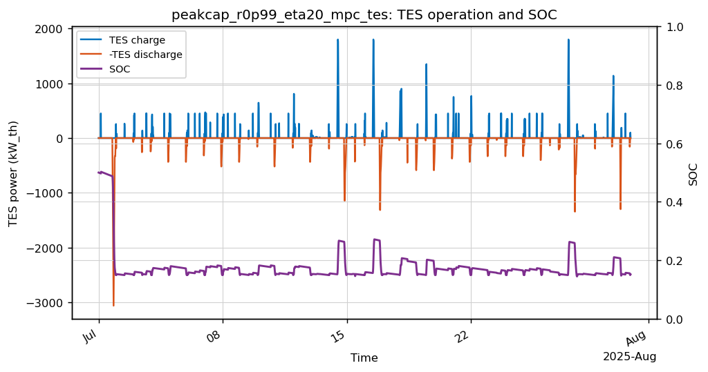
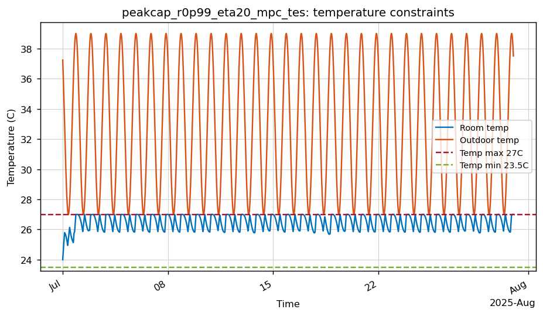
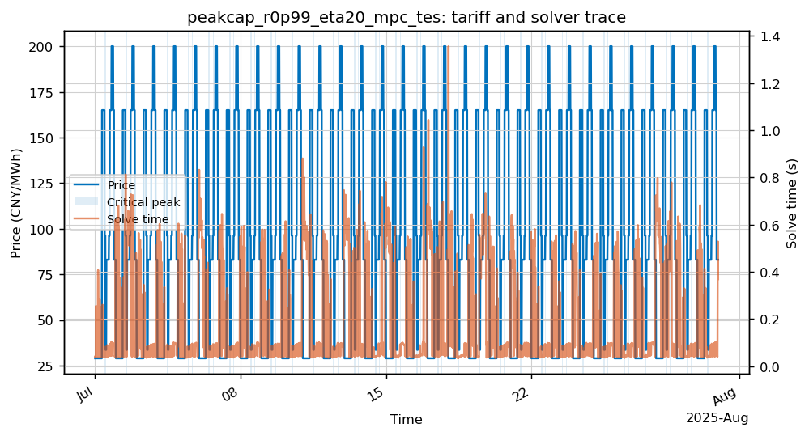

# peakcap_r0p99_eta20_mpc_tes

- Category: `Peak-cap`
- Raw run directory: `results\china_tou_dr_matrices_20260506\raw\peakcap_r0p99_eta20_mpc_tes`

## Key Metrics

| Metric | Value |
|---|---:|
| Controller | mpc |
| Steps | 2880 |
| Total cost CNY | 1,307,748.99 |
| Grid import kWh | 14,276,827.63 |
| Peak grid kW | 20,879.10 |
| Temp violation degree-hours | 0.0026 |
| Fallback count | 0 |
| Solve time p95 s | 0.5864 |
| Final SOC | 0.1522 |
| TES charge kWh_th | 21,527.31 |
| TES discharge kWh_th | 20,132.49 |
| DR event count | 0 |

## Analysis

- 该 case 的月总成本为 1,307,748.99 CNY，峰值购电为 20,879.10 kW。
- 存在温度约束压力：温度违约为 0.003 degree-hours，最高温度 27.010 C。
- 求解过程中未触发 fallback。
- 与配对场景 `peakcap_r0p99_eta20_mpc_no_tes` 相比，`mpc_no_tes -> mpc` 的 TES 增量为 节省 207.64 CNY/月。
- Peak-cap 参考峰值为 21,090.00 kW，最大 slack 为 0.000000 kW。

## Figures

### Grid/PV/power trace

### TES charge/discharge and SOC

### Temperature constraints

### Tariff, critical-peak/fallback flags, and solver time

