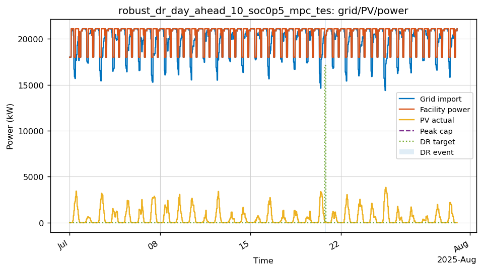
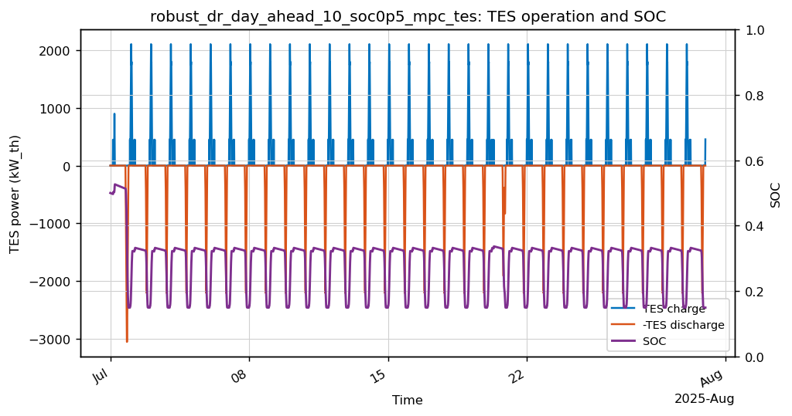
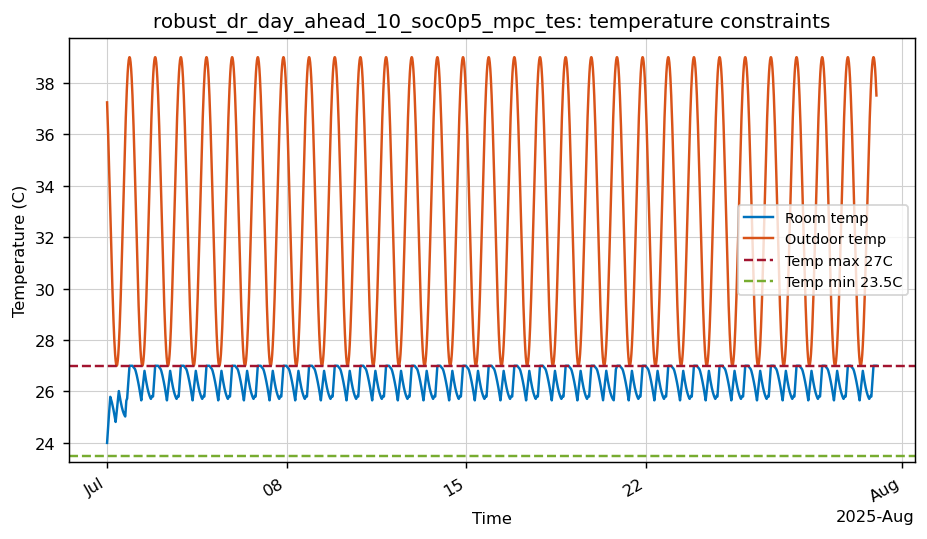
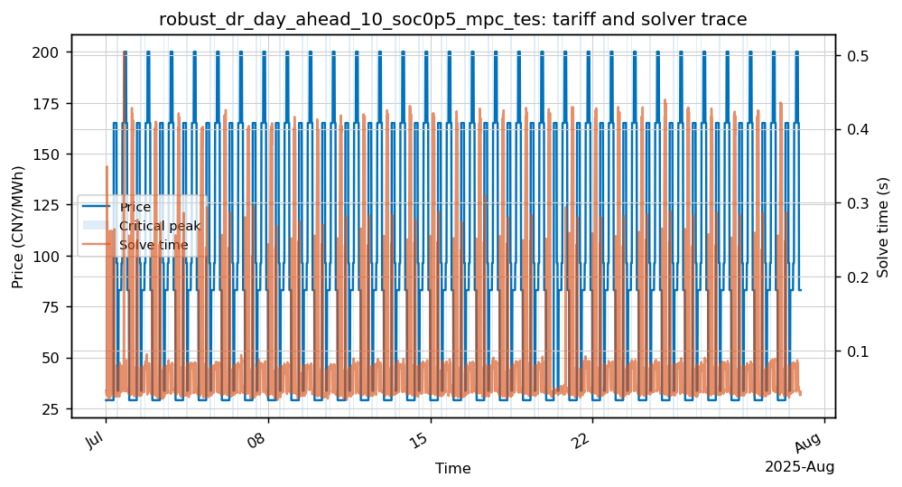

# robust_dr_day_ahead_10_soc0p5_mpc_tes

- Category: `Robustness`
- Raw run directory: `results\china_tou_dr_matrices_20260506\raw\robust_dr_day_ahead_10_soc0p5_mpc_tes`

## Key Metrics

| Metric | Value |
|---|---:|
| Controller | mpc |
| Steps | 2880 |
| Total cost CNY | 1,302,534.56 |
| Grid import kWh | 14,283,763.74 |
| Peak grid kW | 21,090.00 |
| Temp violation degree-hours | 0.0000 |
| Fallback count | 0 |
| Solve time p95 s | 0.3811 |
| Final SOC | 0.1559 |
| TES charge kWh_th | 104,355.17 |
| TES discharge kWh_th | 88,948.27 |
| DR event count | 1 |

## Analysis

- 该 case 的月总成本为 1,302,534.56 CNY，峰值购电为 21,090.00 kW。
- 温度违约为 0，当前代理模型下满足温度约束。
- 求解过程中未触发 fallback。
- 与配对场景 `robust_dr_day_ahead_10_soc0p5_mpc_no_tes` 相比，`mpc_no_tes -> mpc` 的 TES 增量为 节省 641.81 CNY/月。
- DR 事件数为 1，请求削减 3,800.00 kWh，达成削减 2,060.78 kWh。
- 事件表记录 1 条事件，情景估算 DR 收益为 6,182.34 CNY。

## Event Table

| event_id   | scenario_id                           | event_type   | event_window                               |   baseline_energy_kwh |   requested_reduction_kwh |   served_reduction_kwh |   response_rate |   tes_event_discharge_kwh_th |   event_temp_violation_dh |   dr_revenue_cny |
|:-----------|:--------------------------------------|:-------------|:-------------------------------------------|----------------------:|--------------------------:|-----------------------:|----------------:|-----------------------------:|--------------------------:|-----------------:|
| dr_event   | robust_dr_day_ahead_10_soc0p5_mpc_tes | day_ahead    | 2025-07-20 18:00:00 to 2025-07-20 19:45:00 |                 38000 |                      3800 |                2060.78 |        0.542311 |                      1633.09 |                         0 |          6182.34 |

## Figures

### Grid/PV/power trace

### TES charge/discharge and SOC

### Temperature constraints

### Tariff, critical-peak/fallback flags, and solver time

