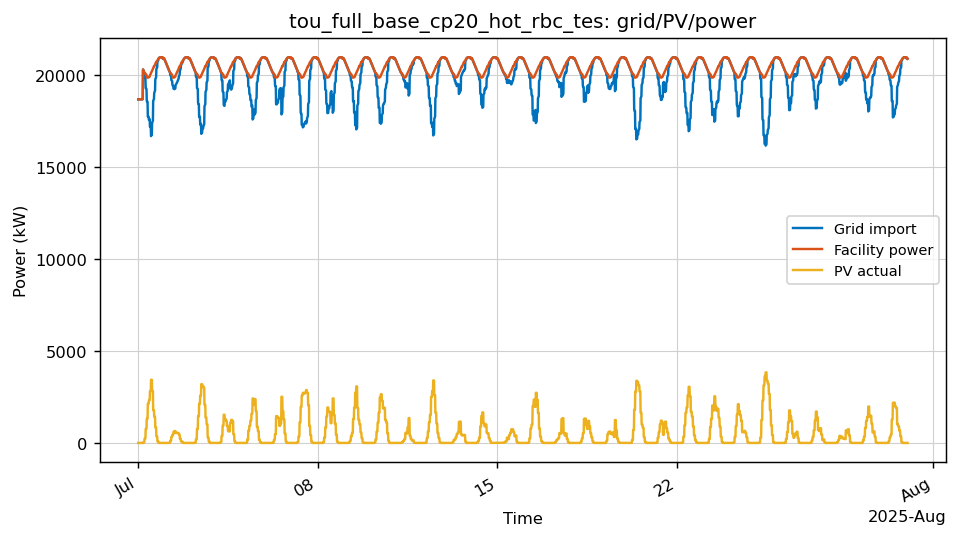
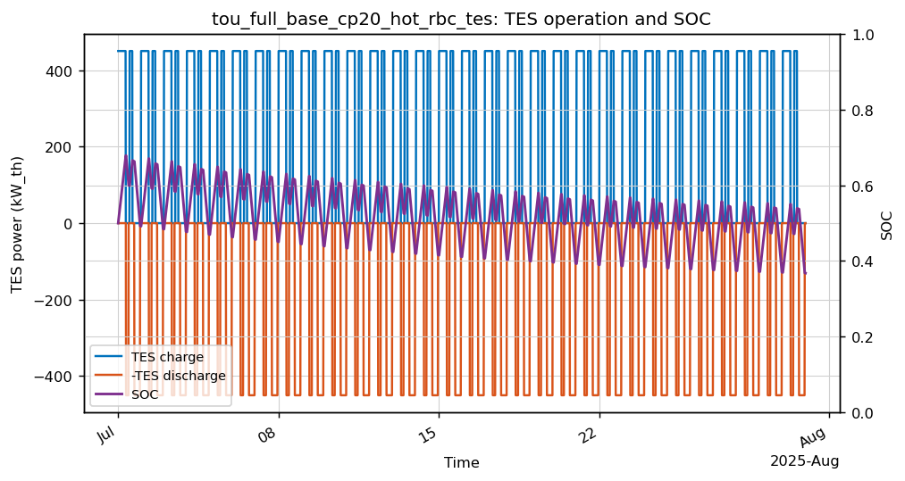
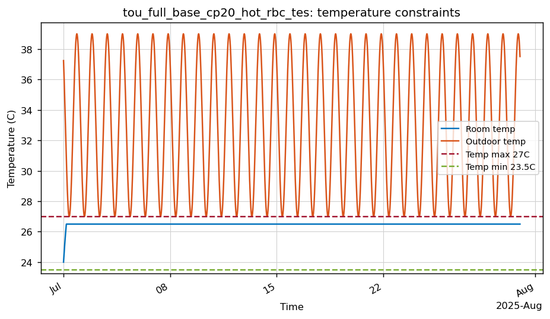
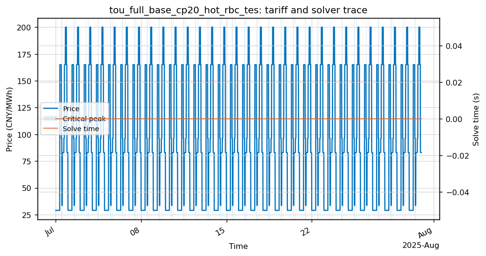

# tou_full_base_cp20_hot_rbc_tes

- Category: `TOU full compare`
- Raw run directory: `results\china_tou_dr_matrices_20260506\raw\tou_full_base_cp20_hot_rbc_tes`

## Key Metrics

| Metric | Value |
|---|---:|
| Controller | rbc |
| Steps | 2880 |
| Total cost CNY | 1,351,195.43 |
| Grid import kWh | 14,332,611.58 |
| Peak grid kW | 20,954.55 |
| Temp violation degree-hours | 0.0000 |
| Fallback count | 0 |
| Solve time p95 s | 0.0000 |
| Final SOC | 0.3677 |
| TES charge kWh_th | 148,500.00 |
| TES discharge kWh_th | 118,125.00 |
| DR event count | 0 |

## Analysis

- 该 case 的月总成本为 1,351,195.43 CNY，峰值购电为 20,954.55 kW。
- 温度违约为 0，当前代理模型下满足温度约束。
- 求解过程中未触发 fallback。

## Figures

### Grid/PV/power trace

### TES charge/discharge and SOC

### Temperature constraints

### Tariff, critical-peak/fallback flags, and solver time

