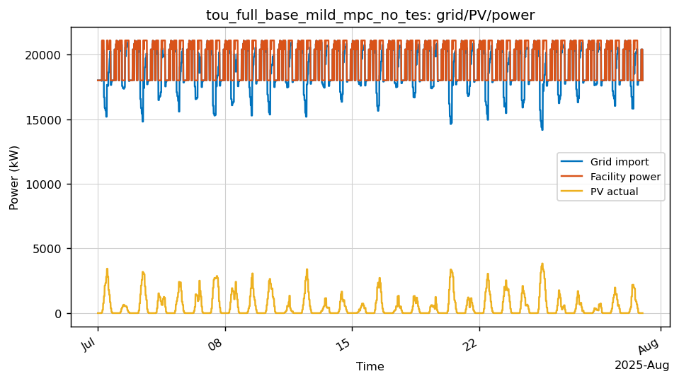
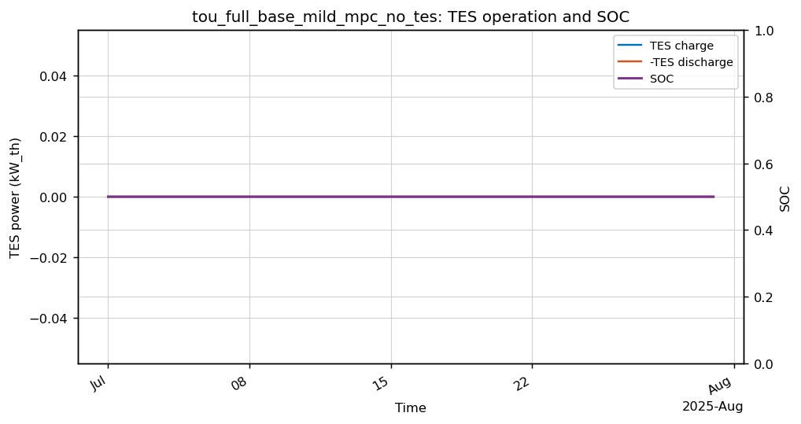
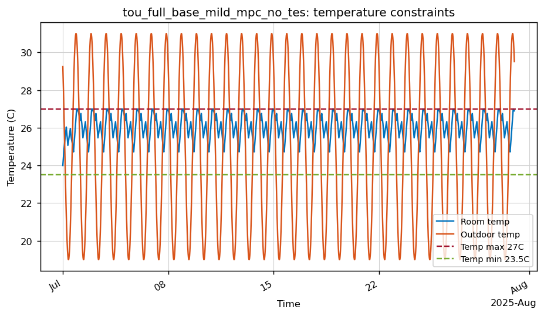
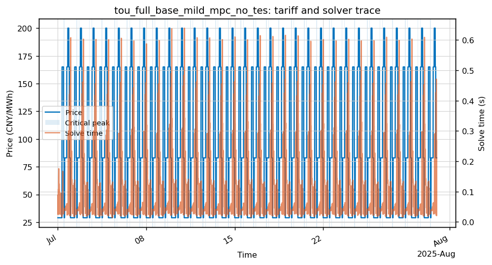

# tou_full_base_mild_mpc_no_tes

- Category: `TOU full compare`
- Raw run directory: `results\china_tou_dr_matrices_20260506\raw\tou_full_base_mild_mpc_no_tes`

## Key Metrics

| Metric | Value |
|---|---:|
| Controller | mpc_no_tes |
| Steps | 2880 |
| Total cost CNY | 1,225,472.45 |
| Grid import kWh | 13,705,337.24 |
| Peak grid kW | 21,090.00 |
| Temp violation degree-hours | 0.0100 |
| Fallback count | 0 |
| Solve time p95 s | 0.3164 |
| Final SOC | 0.5000 |
| TES charge kWh_th | 0.00 |
| TES discharge kWh_th | 0.00 |
| DR event count | 0 |

## Analysis

- 该 case 的月总成本为 1,225,472.45 CNY，峰值购电为 21,090.00 kW。
- 存在温度约束压力：温度违约为 0.010 degree-hours，最高温度 27.001 C。
- 求解过程中未触发 fallback。
- 与配对场景 `tou_full_base_mild_mpc_tes` 相比，`mpc_no_tes -> mpc` 的 TES 增量为 增加成本 315.09 CNY/月。

## Figures

### Grid/PV/power trace

### TES charge/discharge and SOC

### Temperature constraints

### Tariff, critical-peak/fallback flags, and solver time

